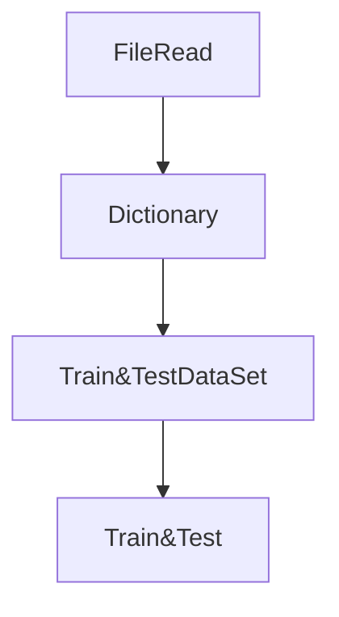

**Supervised Learning을 이용한 품사 Tagging 시스템**
---
2017.04 ~ 2017.07


- 품사 Tagging
	
    	주어진 문장에서 각 단어가 어떤 품사인지를 분류하는 것

- Input data
		
        1. 영문 txt 파일
        2. txt 파일의 각 단어에 대한 정답 (45개의 품사)  	
	| W.R.| Grace | holds | three | of | Grace | Energy | 's | seven | board | seats | .|
	|:---:|:-----:|:-----:|:-----:|:--:|:-----:|:------:|:--:|:-----:|:-----:|:-----:|::|
    |20| 	20 |		39 	|	9| 	13| 20|	 20| 24| 9| 19|	   22   | 6|

- FLOW


	1. 전체 영문 txt 파일을 읽어들여 사용된 단어를 수집하고 단어에 대한 번호를 부여한다. (단어번호와 품사종류에 대한 Matching)
	
    2. 각 단어에 대한 사전을 생성한다. (각 단어번호로 50개의 random number를 할당한다.)

	3. 문장에서 단어 주위의 1 단어를 포함 총 3개의 단어의 사전 값, 150개의 float 을 한개의 Input data로 Train을 수행한다. 
	결과로 NN의 parameter와 word Dictionary 들도 갱신한다.
    
    4. test 를 수행한다.


- 결과

	AP corpus 약 60,000 문장 1,100,000개의 단어을 이용해 train을 수행, 10,000 문장으로 test를 진행 하였다. 생성된 단어의 수는 약 6만 단어가 생성 되었다.
	hidden layer -> 200개의 TLU 구성했을때 
    CPU epoch time : 338965.000000
    ```
1 precise: 0.900842
CPU epoch time : 333389.000000
2 precise: 0.925522
CPU epoch time : 334645.000000
...
22 precise: 0.952963
CPU epoch time : 340750.000000
```

- 개선 사항

	단어에 대한 어근분리작업이 입력되는 문장에 대해 수행되어야 한다.


## Supervised Learning
---
 교사학습은 각 testcase 대해 정답(label)을 갖고 parameter를 갱신하는 작업으로 크게 3가지 과정으로 진행된다. 
 먼저 내가 사용된 용어에 대한 명칭을 정리하자면 
 **in** : TLU로 들어가는 INPUT
 **f**	: TLU의 OUTPUT
 **weight** : 뉴런과 다음층의 뉴런사이의 가중치
 **delta**	: 한 뉴런의 INPUT에 대한 전체 LOSS function 의 미분값
 **bias**	: 그냥 bias...
 **Loss Function** : 최종출력과 정답출력의 차이에 대한 함수로 Cross Entrophy를 사용하였다.
 시스템이 출력한 확률 분포와 정답의 분포 사이의 거리를 계산한다. 정답의 확률분포란 45개의 최종층중 정답의 뉴런만 1 나머지는 0을 갖는 분포이다. ***훈련의 최종목표는 이 함수의 값을 최소로 갖는 파라미터들 구하는 것***이다.
 **Soft Max** : 최종층의 각 뉴런의 출력을 이용하여 각 뉴런이 시스템의 출력으로 결정될 확률로 만들어준다. 즉 최종층의 출력을 확률분포로 만든다.
**sigmoid** : 각 뉴런의 출력을 미분가능한 (-1,1) 로 바꾼다.
 
 **forward**
 	한 층의 TLU로 부터 다음 층으로 값을 전달하는 과정. Loss를 구한다.
 
 **backward**
 	Loss 를 이용, delta를 구한다.
    
**update**
	delta를 이용해서 모든 Parameter들을 갱신한다. 품사 Tagging에서는 dictionary도 갱신한다.
    
##### 정의
in~i~^l^=sum(f~j~^l-1^ *  weight~ji~^l^) + bias~i~^l^
f~i~^l^=sigmoid(in~i~^l^)
sigmoid(x)=(1+e^-x^)^-1^
softmax(t)= e^t^/sum(e^i^)
loss=sum(-t~i~*lny~i~)	(t~i~=정답 확률(0or1),y~i~=시스템 출력 확률)
delta~i~^j^=dloss/din~i~^j^

##### loss의 최소화

최종 목표는 loss를 최소로 만드는 parameter를 구하는 것이다. 이는 gradient decendant 방법을 이용한다.
parameter 와 Loss 가 함수 관계를 이루고 있기때문에 Loss를 최소를 만들기 위해서 미분을 구해서 빼는 방법을 이용한다. (최대를 구하고 할때는 더하면 된다. 이는 그림으로 생각해보면 쉽게 이해할 수 있다.)


####최종층에서의 parameters

최종층(l layer)에서 조절해야할 parameter는 in~i~^l^,weight~ji~^l^,delta~i~^l^ 이다.

**1. delta~i~^l^**


loss
= sum(t~fi~*lny~fi~)
= -t~0~*lny~0~ + (-t~1~*lny~1~) + .. + (-t~i~*lny~i~) + ... 	(t~0~=t~1~=..=0, t~g~=1)
= -t~fg~* lny~fg~     
= -lny~fg~	(y~fg~=e^fg^/sum(e^fi^))
= -(ln e^fg^ - ln sum(e^fi^))		  (g , i 는 각각 g, i 번째 뉴런의 출력값 f~g~,f~i~이다)
= ln sum(e^fi^) - f~g~

delta~i~^l^
dloss/din~i~^l^
= dloss/df~i~^l^	(최종층에서 f~i~^l^=in~i~^l^)
= exp(f~i~^l^)/sum(exp(f~j~^l^))  - 1~i=g~ 

**2. weight~ji~^l^**
###### 아래부터는 loss를 E 로 표기함

dE/dweight~ji~^l^
=(dE/din~i~^l^) x (din~i~^l^/dweight~ji~^l^)
= delta~i~^l^  x (din~i~^l^/dweight~ji~^l^)

- in~i~^l^
= sum(f~j~^l-1^ *  weight~ji~^l^) + bias~i~^l^
= f~1~^l-1^ *  weight~1i~^l^ + f~2~^l-1^ *  weight~2i~^l^ + ... + f~j~^l-1^ *  weight~ji~^l^ + ... + bias~i~^l^

- din~i~^l^/dweight~ji~^l^
=  f~j~^l-1^	 
- din~i~^l^/dbias~i~^l^
= 1

= delta~i~^l^  x  f~j~^l-1^

**3. bias~i~^l^**

dE/dbias~i~^l^
=(dE/din~i~^l^) * (din~i~^l^/dbias~i~^l^)
= delta~i~^l^

#### 중간층에서의 Parameters

중간층에서 in~i~^l^ 와 E 는 다음층의 in~j~^l+1^의 함수 E(in~1~^l+1^,in~2~^l+1^,..,in~j~^l+1^ ,.. )로 표현 가능하다.


**1. delta~i~^l^**

dE(in~1~^l+1^,in~2~^l+1^,..,in~j~^l+1^ ,.. )/din~i~^l^
=(dE/din~1~^l+1^)*(din~1~^l+1^/din~i~^l^) + (dE/din~2~^l+1^)*(din~2~^l+1^/din~i~^l^) + ... + (dE/din~j~^l+1^)*(din~j~^l+1^/din~i~^l^) + ...

- sigmoid'(x) = (1 - sigmoid(x)) * sigmoid(x)

- in~i~^l+1^=sum(f~j~^l^ *  weight~ji~^l+1^) + bias~i~^l+1^
= sum(sigmoid(in~j~^l^) *  weight~ji~^l+1^) + bias~i~^l+1^
= sigmoid(in~1~^l^) *  weight~1i~^l+1^ + sigmoid(in~2~^l^) *  weight~2i~^l+1^ + ... + sigmoid(in~j~^l^) *  weight~ji~^l+1^ + ...
- din~j~^l+1^/din~i~^l^
= sigmoid'(in~j~^l^) *  weight~ji~^l+1^ 
= sigmoid(in~j~^l^) * (1-sigmoid'(in~j~^l^)) weight~ji~^l+1^ 

= delta~1~^l+1^ * sigmoid(in~j~^l^) * (1-sigmoid(in~j~^l^)) weight~j1~^l+1^ + delta~2~^l+1^ * sigmoid(in~j~^l^) * (1-sigmoid(in~j~^l^)) weight~j2~^l+1^ + ... + delta~i~^l+1^ * sigmoid(in~j~^l^) * (1-sigmoid(in~j~^l^)) weight~ji~^l+1^ + ...
= sum~i~(delta~i~^l+1^ x sigmoid(in~j~^l^) x (1-sigmoid(in~j~^l^)) x weight~ji~^l+1^ )


**2. weight~ji~^l^**

dE/ weight~ji~^l^
= (dE/din~i~^l^) * (din~i~^l^/dweight~ji~^l^)
= delta~i~^l^ * f~j~^l-1^

<!--- l+1 층의 뉴런을 k , l층을 i , l-1층을 j 라 고 할때
dE(in~1~^l+1^,in~2~^l+1^,..,in~k~^l+1^ ,.. )/dweight~ji~^l^ 으로 볼 수 도 있다.
= (dE/din~1~^l+1^) x (din~1~^l+1^/dweightji^l^) + (dE/din~2~^l+1^) x (in~2~^l+1^/dweightji^l^)+ ... + ***(dE/din~k~^l+1^) x (din~k~^l+1^/dweightji^l^)*** + ... 으로 볼수 있으나 직접적인 영향이 없다.
in~k~^l+1^/dweightji^l^ 를 제외한 다른 것을 보자. 
(in~1~^l+1^/dweightji^l^)에서 in~1~^l+1^= sum(w~p1~^l+1^*f~i~^l^) + bias~1~^l+1^
in~k~^l+1^=sum(weight~ik~^l+1^ * f~i~^l^) + bias~k~^l+1^ 이므로 weightji^l^ 와 전혀 상관이 없다. 따라서 그 미분값은 0 이다.
그림으로 이해하면 보다 쉽다. 3개의 층사이에서 중간층-아랫층의 w 와 윗층의 in은 같은 중간층의 i를 제외한 어떠한 연결이 없다.
-->


**3. bias~i~^l^**

dE/ bias~i~^l^
=(dE/din~i~^l^)*(din~i~^l^/dbias~i~^l^)
=delta~i~^l^

**4. 입력층 X~i~^l^**

dE/x~i~^l^
=(dE/in~i~^0^)* (in~0~^l^/X~i~^l^)
- in~i~^0^=x~i~^0^

=delta~i~^l^


